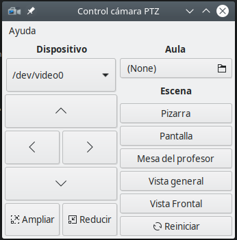

# UATPTZLinux
Programa para GNU/Linux que permite controlar cámaras PTZ, desarrollado para las cámaras que usa la Universidad de
Córdoba (AVER VC520 Pro), aunque puede configurarse fácilmente para otros modelos de cámaras PTZ.

## Instalación

### Requisitos del sistema

- `libgtk-3`
- `libjson-c4`
- `v4l-utils`

En distribuciones Debian y derivadas se pueden instalar con:

```bash
sudo apt install libgtk-3 libjson-c4 v4l-utils
```


### Construir

Para compilar el programa son necesarias las siguientes librerías de desarrollo:

- `libgtk-3-dev`
- `libjson-c-dev`

En distribuciones Debian y derivadas se pueden instalar con:

```bash
sudo apt install libgtk3-dev libjson-c-dev
```

Descarga el código fuente:

```bash
git clone https://github.com/jmaphys/UATPTZLinux.git
cd UATPTZLinux
```

Y compila el ejecutable:

```bash
mkdir cmake-build-debug
cd cmake-build-debug
cmake ..
make
```

Se creará el archivo ejecutable `UATPTZLinux`.

## Uso

Escribe el siguiente comando en un terminal y pulsa <kbd>Enter</kbd>:

```bash
./UATPTZLinux
```

Se abrirá una ventana como esta:



En el desplegable *Dispositivo* escoge el que corresponda a la cámara. La versión actual no detecta automáticamente la
cámara, pero suele ser `/dev/video1` en un portátil con webcam. Para saber qué dispositivo es, usa el siguiente comando:

```bash
v4l2-ctl --list-devices
```

Ahora carga el archivo de las escenas para el aula correspondiente con el botón de debajo de **Aula**. El formato del
archivo debe ser json, con la siguiente estructura:

```json
[
  {
    "Name": "General",
    "Tilt": -101898,
    "Pan": 137097,
    "Zoom": 0
  },
  {
    "Name": "Frontal",
    "Tilt": -72784,
    "Pan": 216469,
    "Zoom": 221
  },
  {
    "Name": "Profesor",
    "Tilt": -83702,
    "Pan": 194822,
    "Zoom": 661
  },
  {
    "Name": "Pizarra verde",
    "Tilt": -50949,
    "Pan": 194822,
    "Zoom": 581
  },
  {
    "Name": "Pantalla",
    "Tilt": -54588,
    "Pan": 270586,
    "Zoom": 471
  }
]
```

Ya puedes utilizar los botones de escenas para cambiar la posición de la cámara.

El botón *Reiniciar* situa la cámara en el valor 0 para Pan, Tilt y Zoom.

## Autores

- Manuel Alcaraz Zambrano.
- José Manuel Alcaraz Pelegrina.

## [Licencia](https://github.com/jmaphys/UATPTZLinux/blob/master/LICENSE)

```
This program is free software: you can redistribute it and/or modify
it under the terms of the GNU General Public License as published by
the Free Software Foundation, either version 3 of the License, or
(at your option) any later version.

This program is distributed in the hope that it will be useful,
but WITHOUT ANY WARRANTY; without even the implied warranty of
MERCHANTABILITY or FITNESS FOR A PARTICULAR PURPOSE.  See the
GNU General Public License for more details.

You should have received a copy of the GNU General Public License
along with this program.  If not, see <https://www.gnu.org/licenses/>.
```
